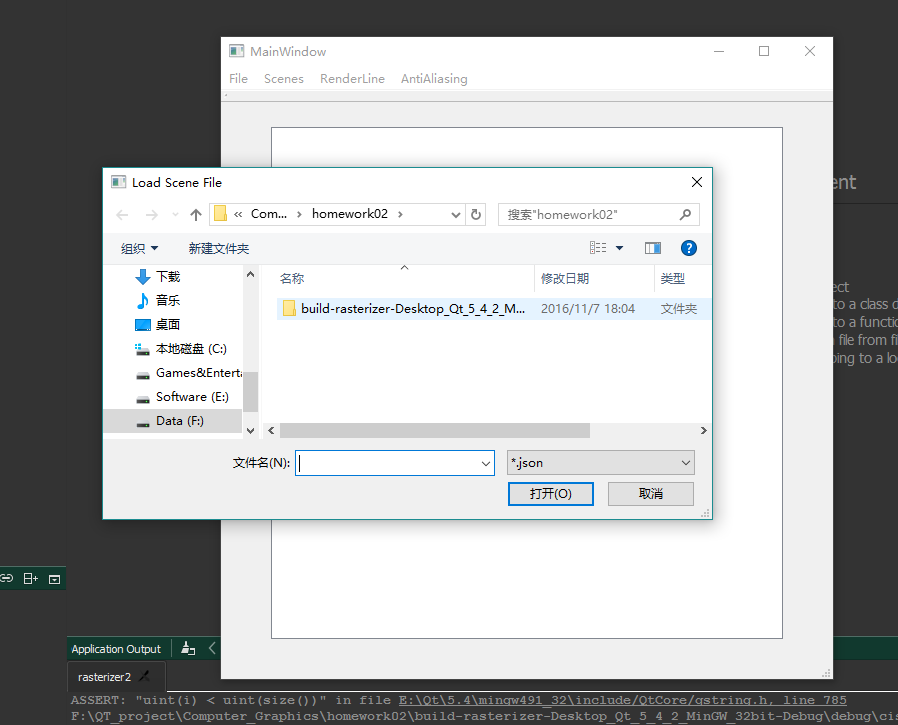
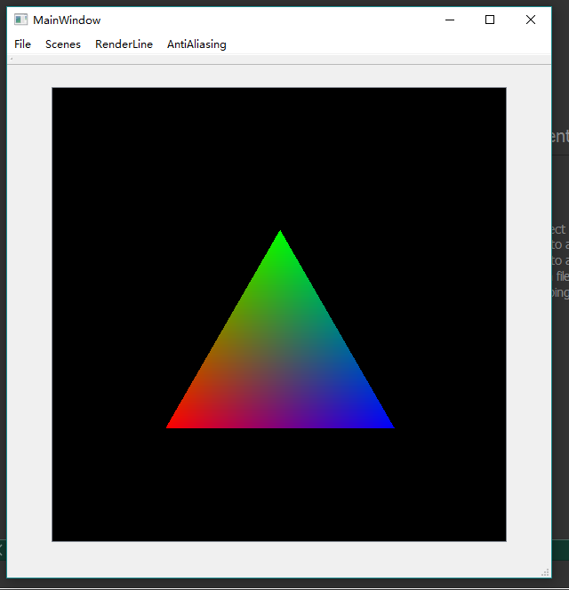
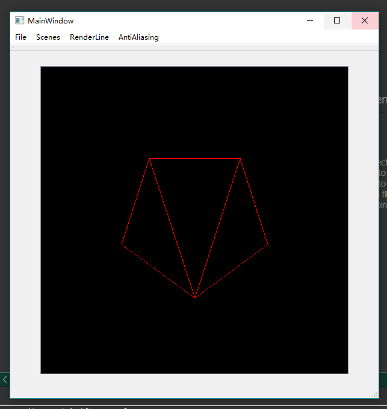

# Computer_Graphics_HW02_Rasterizer2D
2D rasterizer, developed in C++, Qt Creator
# Description
To create a 2D rasterizer for drawing scenes composed of polygons. 
* Convex Polygon Triangulation
* Line Segments
* Bounding Boxes
* Triangle Rendering 
* Barycentric Interpolation
* Painter's Algorithm

# Screenshots & Results
* **Loading Scene(Draw Triangle)**

* **Loading Scene(Draw Lines)**

